# BIAS-BOUNTY-TEMPLATE

## Instructions

### 1. Create Repository from Template
Click on the green button which says *Use this template* and select *Create a new repository* from the drop down menu. Click on choose owner and select your GitHub username, and then add your desired name for the repository. Select **private** for the scope of the repository.

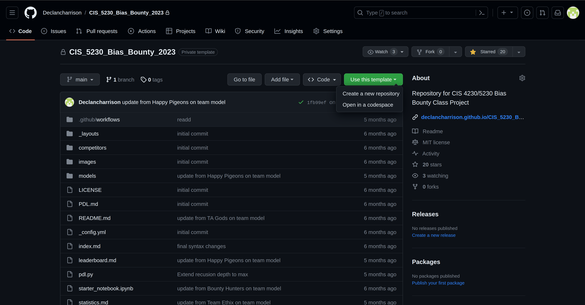

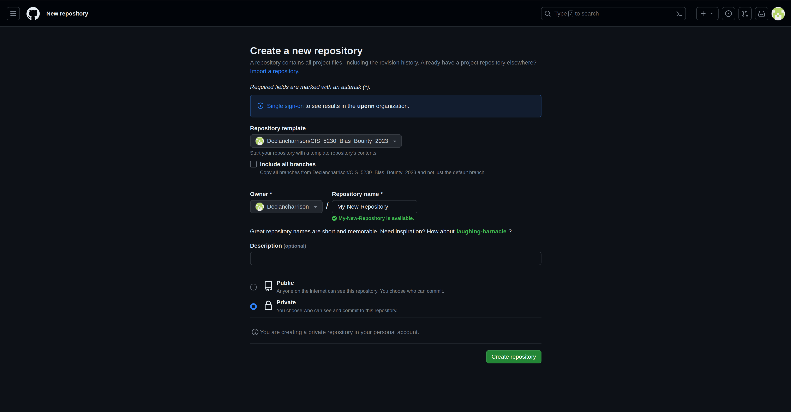

### 2. Set Permissions in your Repository
Navigate to the repository you've just created and click on settings. In the general tab, check the boxes under *Pull Request* next to *Automatically suggest updating pull request branches* and *Automatically delete head branches*. 
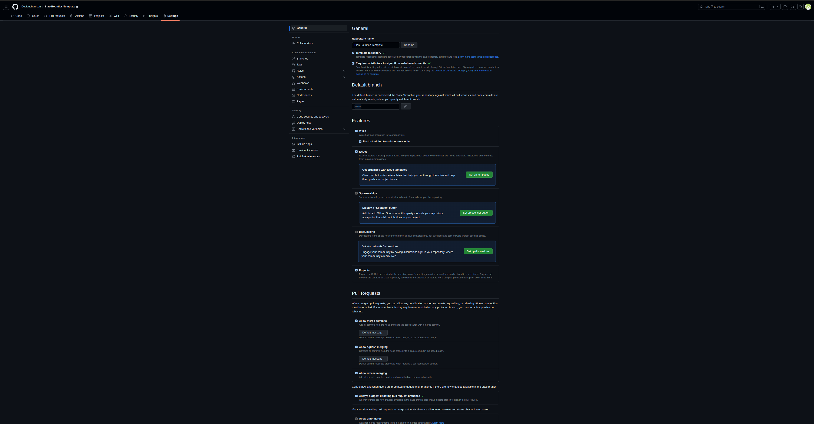

Then, on the left hand side under *Code and automation*, select *Branches* and click on *Add branch profection rule*. 

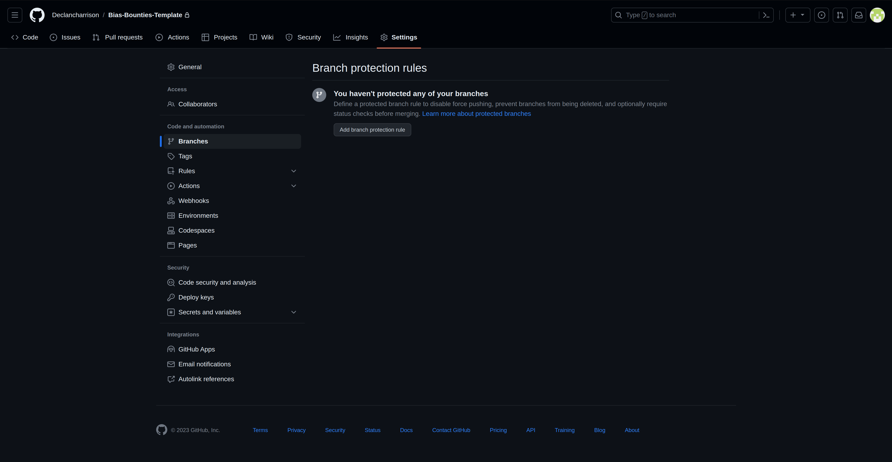

Within the branch rule, name the rule "main" and select the following:

**Protect Matching Branches**
- *Require a pull request before merging*
    - *Require approvals*
    - *Dismiss stale pull request approvals when new commits are pushed*
- *Require status checks to pass before merging*
    - *Require branches to be up to date before merging*
- *Require signed commits*
- *Lock branch*

**Rules applied to everyone incluiding administrators**
- *Allow force pushes*
    - *Specify who can force push*
- *Allow deletions*

Save changes and confirm branch protection rule.

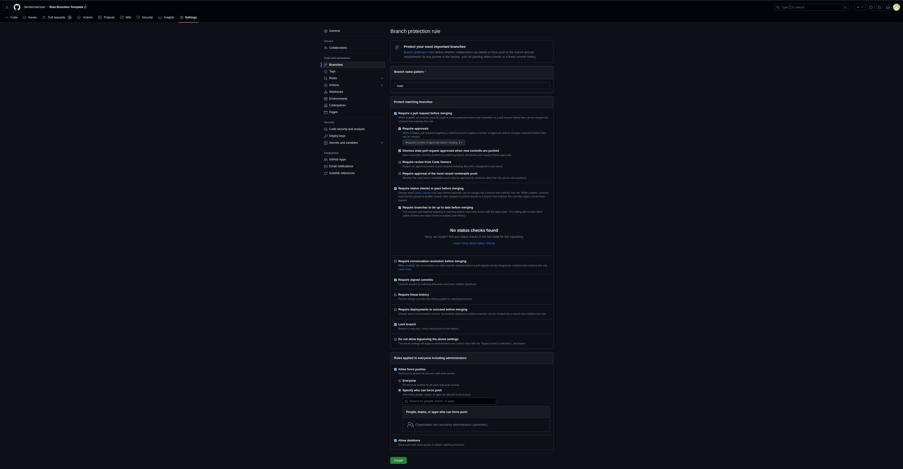

### 3. Clone Repository
In the command line, change directories to the location on your server computer where you want to host the repository. Using SSH, clone the repository with the following command: 
```bash
git clone git@github.com:<your-github-username>/<your-repository-name>.git
```
Note: SSH authentication is required for future commands in the server script. If you need help generating and adding an SSH key, [please refer to the instructions here](https://docs.github.com/en/authentication/connecting-to-github-with-ssh/generating-a-new-ssh-key-and-adding-it-to-the-ssh-agent).

### 4. Add Server Path in GitHub Actions Secrets
Navigate back to your GitHub repository's settings and under the *Security* section on the left hand side, click on *Secrets and variables* and select *Actions* from the drop down menu. Add a repository secret with name "SERVER_PATH" and add the full path to the repository on your host server as the secret. You can find this by navigating to the repository on your server in a terminal and running the command *pwd*.

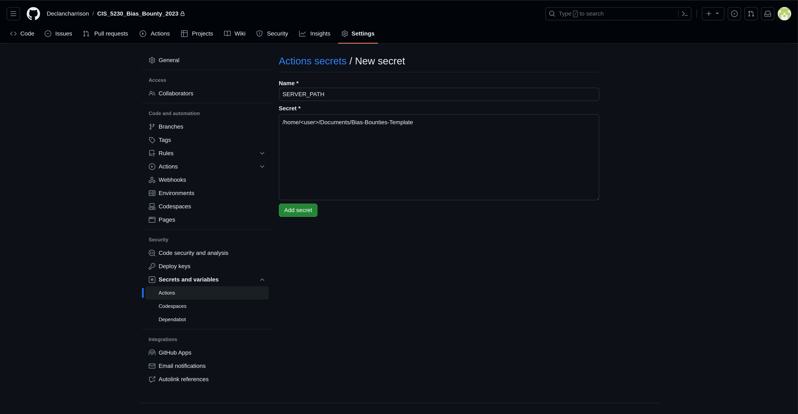

### 5. Download GitHub Actions + Install in Folder
In the same settings page, under *Code and automation* click on *Actions* and select *Runners* from the drop down menu. Click the green button for *New self-hosted runner* in the upper right corner. Select your runner image (Linux) and architecture. In a terminal, navigate to your repository and run the commands in the *Download* section of the page. After the download completes, run the commands in the *Configure* section. Note: there will be multiple times that the configuration prompts you for input; simply press "Enter" during these sections and do not change directory names as it will cause the later installation to break.

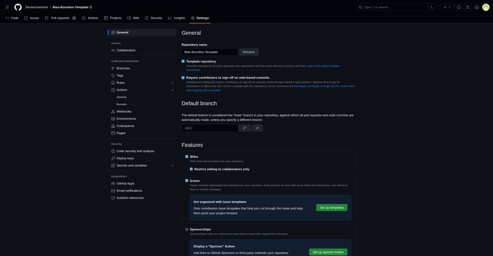
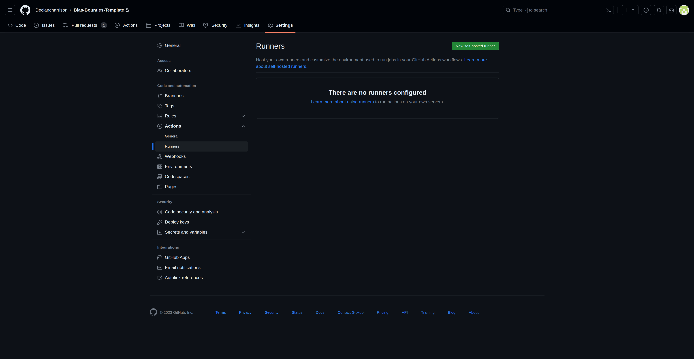
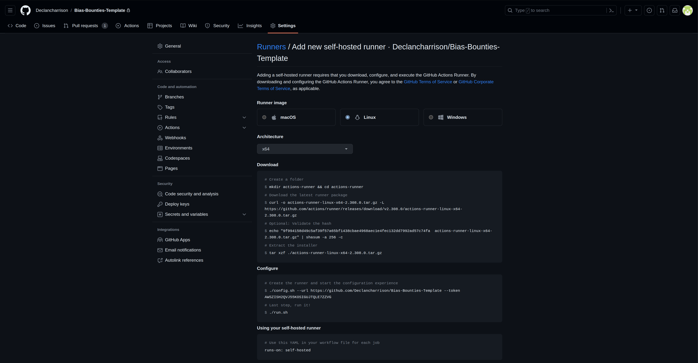

### 6. Add Data + Teams .csv files to Folder
From your server, add your data as a .csv in the repository. The file must contain the target labels under a column "Label" and be loadable through pandas. Next, add a .csv to the repository directory where each row corresponds to a participant and contains their GitHub username and team name. The column names for this .csv should be "Username" and "Team". Examples for both .csv have been added to the repository for your reference under *example_data.csv* and *example_teams.csv*. The data and teams file names will be added to the .gitignore to not be tracked, but it is highly recommended that you remove the files from the directory after installation. The same is true for an initial model which can be added to the folder as a .pkl file. If you choose to not insert an initial model, a base decision tree will be trained for you based on your task.

### 7. Run build.sh
In your repository, run the following commands in a terminal:
```bash
# add execute permisssion to build
chmod +x build.sh

# install bias bounties
./build.sh
```
You will be prompted throughout the installation for information to include your data .csv name, prediction task, loss function, teams .csv name, initial model file name, and update alpha criteria. 

### 8. Start GitHub Actions
Final step, start your server with the following command:

```bash
./runner.sh
```

### 9. (Optional) Add the Default Website
Under your repository's settings on GitHub, select *Pages* under *Code and automation*. On the branch section, select *main* from the dropdown menu and click *Save*. You are able to configure a custom domain if you wish, otherwise your website will be published under www.<github-username>.github.io/<your-repository-name>.

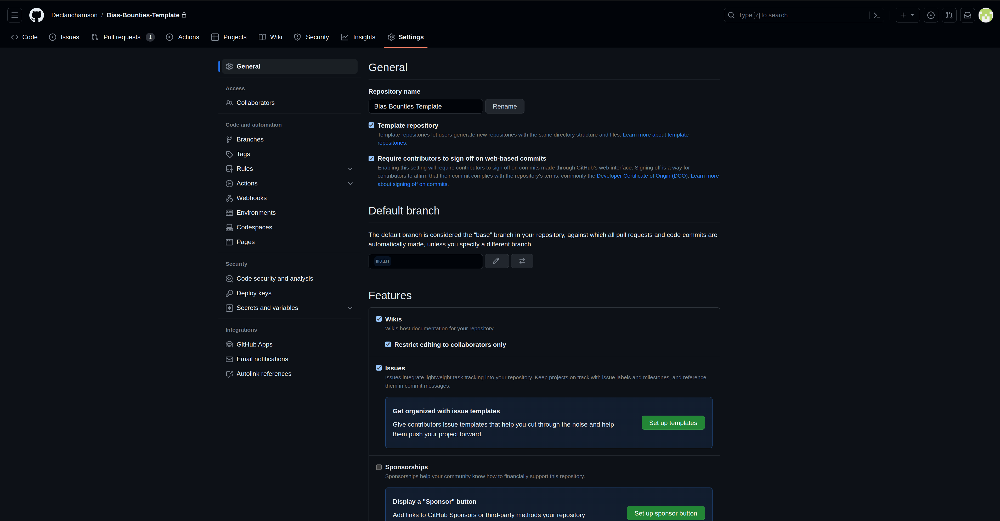
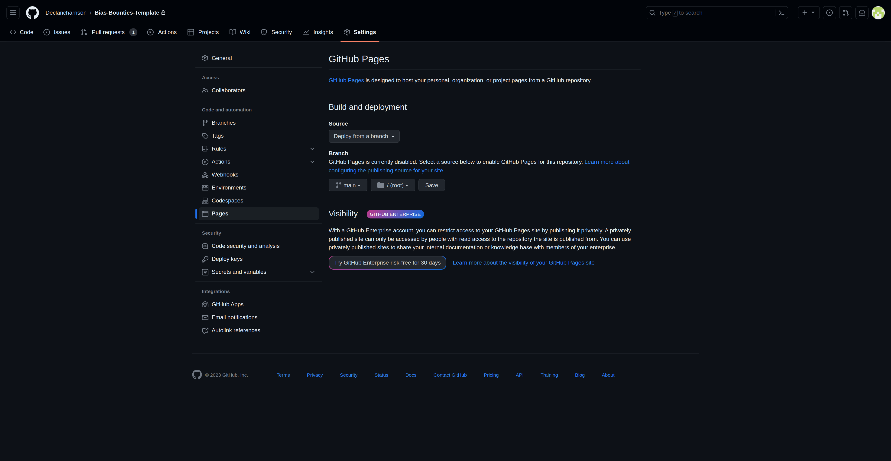

## Happy Hunting!
